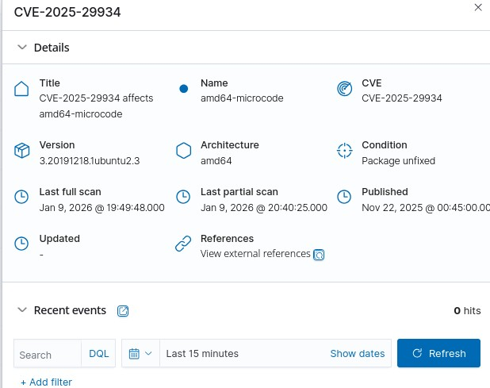

# CVE Analysis Report – Wazuh Vulnerability Detection

## CVE ID
**CVE-2025-29934**

---

## Affected Component
- **Package Name:** amd64-microcode  
- **Version:** 3.20191218.1ubuntu2.3  
- **Architecture:** amd64  
- **Operating System:** Ubuntu Linux

---

## Vulnerability Description
CVE-2025-29934 is a vulnerability affecting the **AMD CPU microcode package**.  
Microcode operates at the **hardware–software boundary**, meaning vulnerabilities at this level can compromise the entire system regardless of OS-level security controls.

---

## Impact
If exploited, this vulnerability may allow:
- **Privilege escalation**
- **Bypassing CPU-level security protections**
- **Potential data leakage**
- **Weakened isolation of virtual machines and containers**

Because this issue affects **hardware-level behavior**, it poses a significant security risk in enterprise and cloud environments.

---

## Severity
- **Severity Level:** Medium  
- **Risk Context:** High impact due to hardware-level exposure

---

## Detection Details
- **Detected By:** Wazuh Vulnerability Detector  
- **Detection Source:** NVD (National Vulnerability Database)  
- **Last Full Scan:** Jan 9, 2026  
- **Last Partial Scan:** Jan 9, 2026  

---

## Security Monitoring Tool Used
- **Wazuh SIEM**
  - Syscollector module for package inventory
  - Vulnerability detector module for CVE correlation
  - Real-time CVE monitoring and alerting

---

## References
- NVD CVE Database  
- Wazuh Vulnerability Detection Documentation

