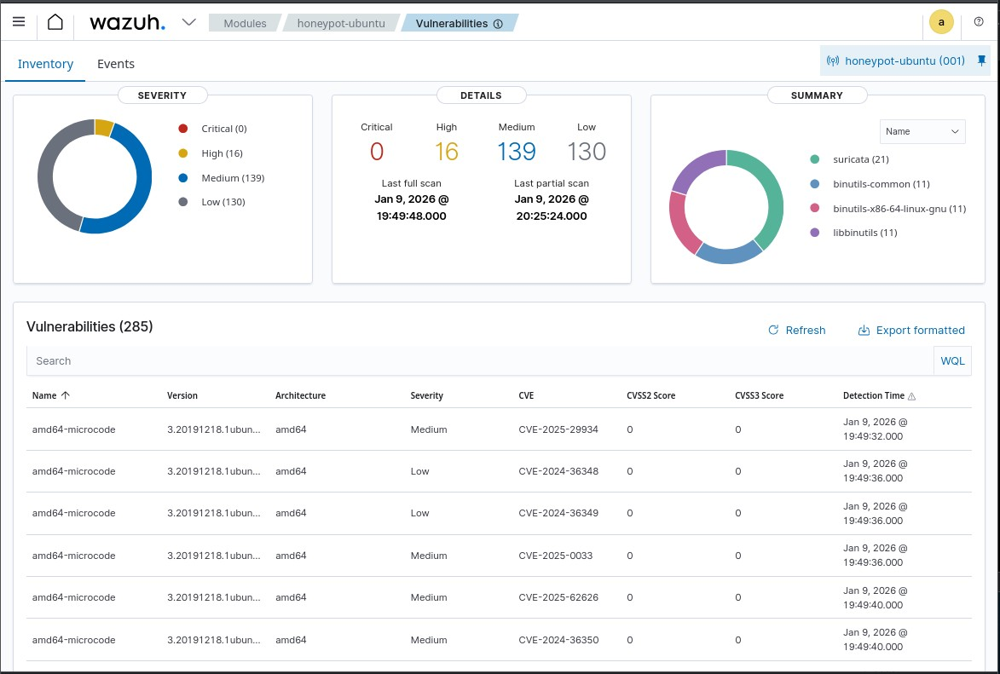

#  Wazuh SIEM & Vulnerability Detection Lab

This project demonstrates the deployment of **Wazuh SIEM** for security monitoring and **vulnerability detection** in a controlled honeypot environment. The lab simulates real-world attacks and analyzes system vulnerabilities using industry-standard tools.

---

## Project Overview

The objective of this project is to:
- Monitor security events generated from attack simulations
- Detect known vulnerabilities (CVEs) in an Ubuntu honeypot
- Gain hands-on experience with SOC and Blue Team tools

Wazuh continuously collects logs, inventories installed packages, and correlates them with trusted vulnerability databases such as **NVD** and **Ubuntu Security Advisories**.

---

##  Lab Architecture

| Machine | OS | Role |
|-------|----|------|
| Kali Linux | Kali | Attacker |
| Ubuntu Server | Ubuntu 22.04 | Honeypot + Suricata IDS |
| Wazuh Server | Ubuntu Server | SIEM Manager & Dashboard |

All machines are deployed inside **VirtualBox** using a **NAT Network**.

---

##  Tools & Technologies

- **Wazuh (Manager, Agent, Dashboard)**
- **Suricata IDS**
- **Ubuntu Server 22.04**
- **Kali Linux**
- **Nmap, SSH brute-force**
- **Syscollector module**
- **NVD & Ubuntu CVE feeds**

---

##  Attack Simulations

The following attacks were safely simulated inside the lab:

- SSH brute-force attacks
- Invalid user login attempts
- Nmap aggressive scanning
- Network reconnaissance
- IDS-based traffic inspection (Suricata)

All attack logs were successfully captured and analyzed in the Wazuh Dashboard.

---

##  Vulnerability Detection

Wazuh vulnerability detection was enabled using:
- Syscollector (package and OS inventory)
- Canonical (Ubuntu) CVE feeds
- National Vulnerability Database (NVD)

